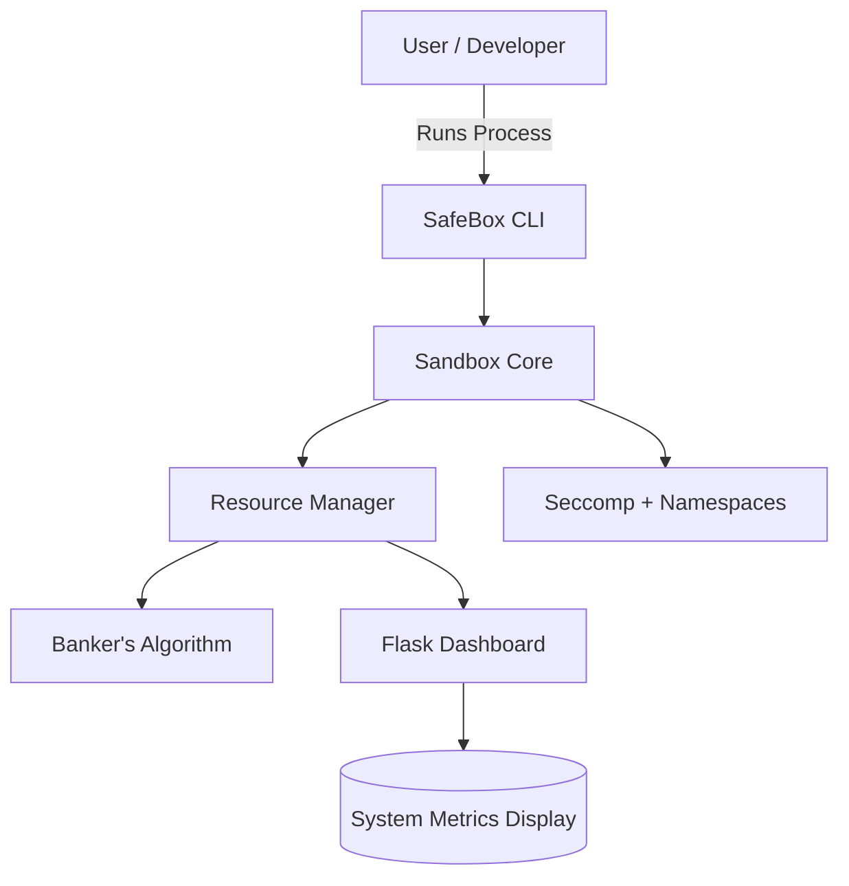

# 🧠 SafeBox: Intelligent Resource Management & Deadlock Prevention System

> 🔒 **SafeBox** is a next-generation sandboxing system designed for secure process isolation, intelligent resource management, and proactive deadlock prevention using the **Banker’s Algorithm**.

---

## 🌟 Highlights

✅ **Secure Process Isolation** – Built using Linux namespaces, cgroups, and seccomp filters
⚙️ **Smart Resource Management** – Dynamically manages CPU, memory, and I/O resources
🧮 **Deadlock Prevention** – Implements the classic Banker’s Algorithm for safe allocation
📊 **Real-Time Monitoring** – Command-line + optional Flask dashboard
🎓 **Built for Learning** – Perfect for Operating Systems coursework and research

---

## 🧩 System Overview

### 🏗️ Core Components

| Component               | Description                                                            |
| ----------------------- | ---------------------------------------------------------------------- |
| 🧱 **Sandbox Core**     | Provides process isolation using Linux namespaces and seccomp filters. |
| ⚙️ **Resource Manager** | Monitors and enforces CPU, memory, and I/O usage.                      |
| 🧮 **Banker Engine**    | Implements Banker’s Algorithm for deadlock prevention.                 |
| 🧰 **Interface Layer**  | CLI tools for management + Flask-based dashboard for visualization.    |

### 🔍 Architecture Diagram



---

## ⚙️ Installation

### 🧰 Prerequisites

* Linux environment (Ubuntu/Debian recommended)
* `g++`, `make`, and `python3`
* `sudo` privileges for namespaces/cgroups

### 🚀 Quick Start

```bash
# Clone the repository
git clone https://github.com/<your-username>/SafeBox.git
cd SafeBox

# Build the system
make

# Run the SafeBox demo (requires sudo for sandbox isolation)
sudo ./bin/safebox_demo

# Launch the optional web dashboard
python3 -m venv venv && source venv/bin/activate
pip install -r requirements.txt
python dashboard/app.py
```

---

## 💻 Usage

### 🧪 Running a Program in Sandbox

```bash
sudo ./bin/safebox_demo --run ./unsafe_program
```

### 📊 Monitoring Resource Usage

```bash
watch -n 2 'ps aux --sort=-%mem | head'
```

### 🌐 Dashboard Access

Open your browser and navigate to: [http://localhost:5000](http://localhost:5000)

---

## 🧮 Example Output

```text
[SafeBox] Starting isolated process...
[Resource Manager] CPU: 35%, Memory: 128 MB
[Banker] Safe state confirmed — allocation granted.
[SafeBox] Process completed successfully.
```

---

## 🧾 Deliverables

* ✅ Sandbox Core (process isolation)
* ✅ Resource Manager (monitor + control)
* ✅ Banker's Algorithm Engine
* ✅ CLI + Flask Dashboard
* ✅ Unit Tests + Documentation

---

## 👩‍💻 Team Ananta

| Member           | Role      | Email                                                             |
| ---------------- | --------- | ----------------------------------------------------------------- |
| **Anika Dewari** | Team Lead | [anikadewari26@gmail.com](mailto:anikadewari26@gmail.com)         |
| **Ayush Negi**   | Developer | [anegi52005@gmail.com](mailto:anegi52005@gmail.com)               |
| **Ritika Bisht** | Developer | [bisht.ritika19200@gmail.com](mailto:bisht.ritika19200@gmail.com) |

---

## 📚 References

* *Operating System Concepts* – Silberschatz, Galvin & Gagne
* *Modern Operating Systems* – Andrew S. Tanenbaum
* Dijkstra (1965) – *The Banker’s Algorithm*
* Linux Namespaces & cgroups Documentation
* [Docker Architecture Guide](https://docs.docker.com/get-started/overview/)
* [Chrome Sandbox Design Docs](https://chromium.googlesource.com/chromium/src/+/master/docs/design/sandbox.md)

---

## 🧩 Contributing

Pull requests are welcome! For major changes, please open an issue first to discuss what you would like to change.

```bash
# Create a new branch
git checkout -b feature/my-feature

# Commit changes
git commit -m "Add new feature"

# Push to remote
git push origin feature/my-feature
```

---

## 📜 License

Licensed under the **MIT License** — free for academic and research use.

---

<p align="center">✨ Built by Team Ananta | B.Tech CSE (3rd Year) ✨</p>
